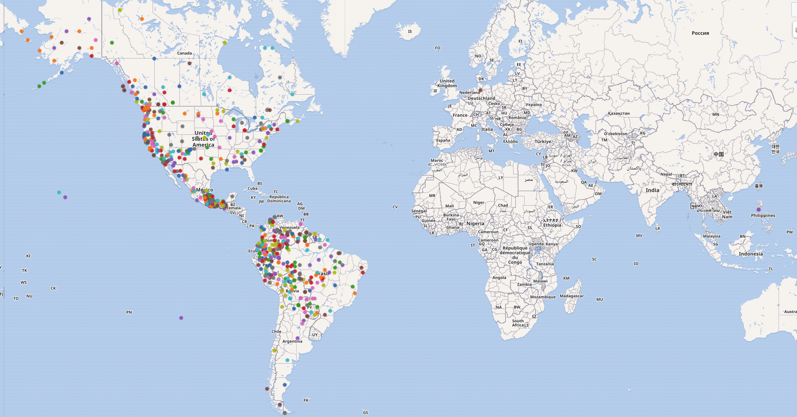

# Proyecto CC7220 - Lenguas nativas de América

## Motivación

Este proyecto surgió de la curiosidad que teníamos respecto a la información presente en wikidata sobre nuestro continente. En particular, nos interesaba saber cuanta información existe sobre lenguas nativas de América en la plataforma. 

Realizamos distintas queries respecto a temas como la cantidad de hablantes y los alfabetos utilizados, entre otras. Estas queries se detallan a continuación.

## Queries

1. [get__language_coordinates](/Queries/get__language_coordinates.sparql): Esta query extrae las coordenadas de todos los lenguajes nativos de América. Consideramos como lenguaje nativo a cualquier lenguaje hablado en América pero no en Europa. Esta query se utilizó como base para construir gran mayoría de las queries restantes.

2. [get__language_danger](/Queries/get__language_danger.sparql): Esta query extrae el estado de peligro en el que se encuentran los lenguaje nativos de América. El estado se refiere a uno publicado por [Ethnologue](https://www.ethnologue.com).

3. [get__speakers_per_language](/Queries/get__speakers_per_language.sparql): Esta query extrae el número de hablantes de cada lenguaje y los ordena de manera decreciente.

4. [get__language_alphabet](/Queries/get__language_alphabet.sparql): Esta query extrae el alfabeto utilizado por cada lenguaje nativo.

5. [get__language_distribution](/Queries/get__language_distribution.sparql): Esta query extrae una imagen que representa la distribución de un lenguaje geográficamente, si es que esta imagen está en Wikidata.

6. [get__language_iso_code](/Queries/get__language_iso_code.sparql): Esta query extrae el código ISO-639-1 si es que el lenguaje lo posee.

7. [get__native_entity_labels](/Queries/get__native_entity_labels.sparql): Esta query, utilizando el resultado anterior, busca entidades que tengan una label escrita en alguno de los lenguajes encontrados previamente.

8. [get__native_country_labels](/Queries/get__native_country_labels.sparql): Esta query, utilizando el resultado de la query 6, busca países que tengan una label escrita en alguno de los lenguajes encontrados previamente.

9. [get__native_chile_labels](/Queries/get__native_chile_labels.sparql): Esta query es la misma que la anterior, pero filtramos los resultados para ver los labels que existen para Chile escritos en alguna de las lenguas nativas encontradas.
